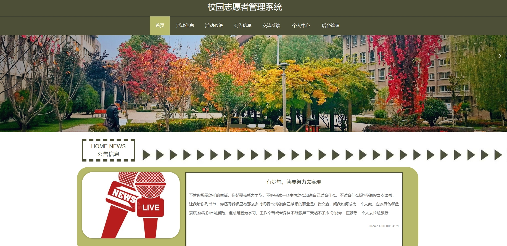
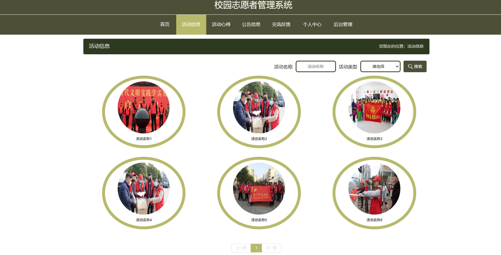
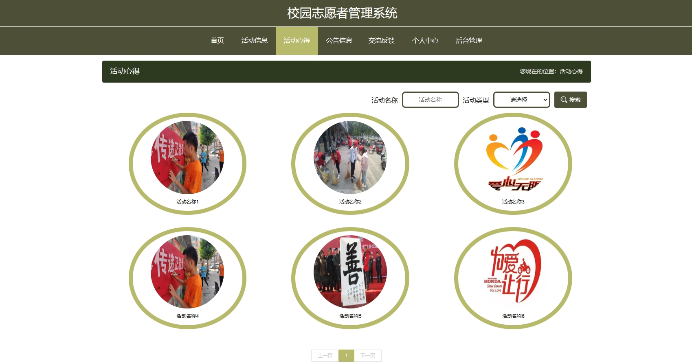
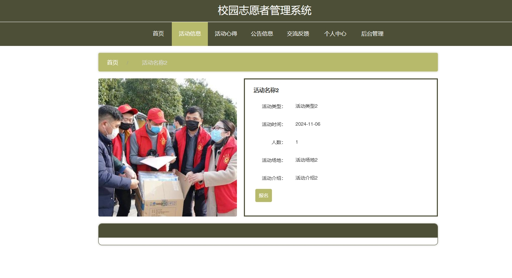
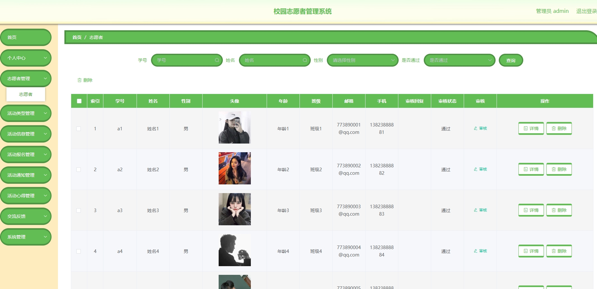
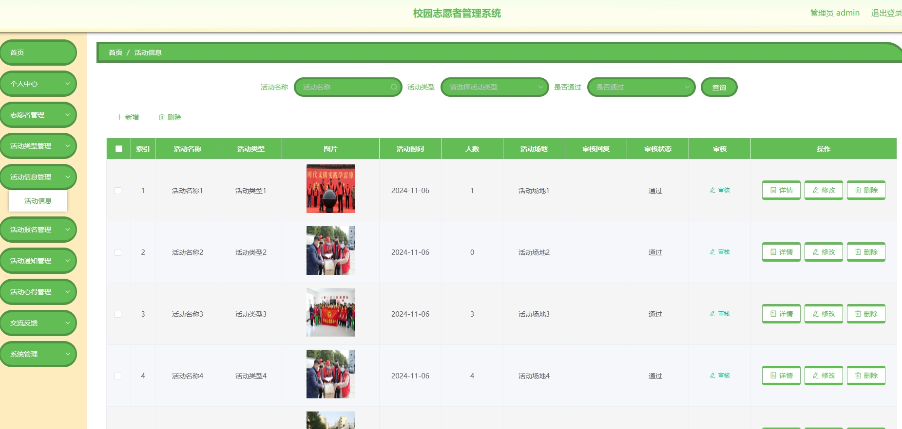
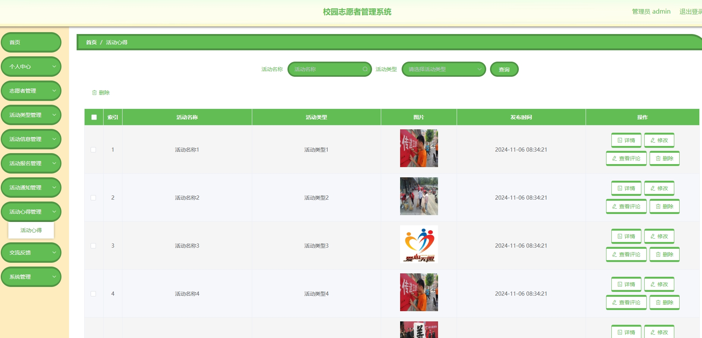
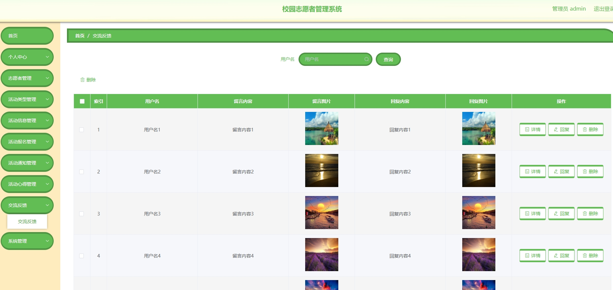
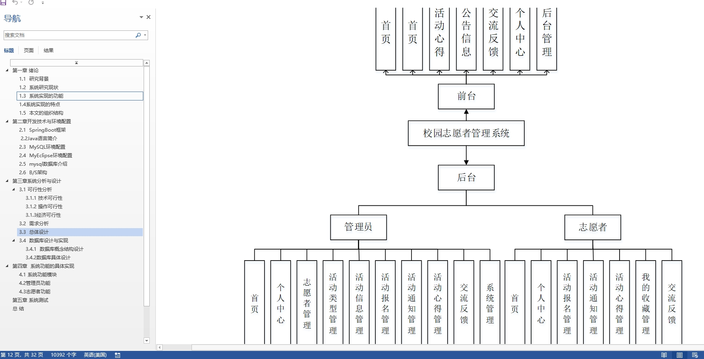

# 1.项目介绍
- 系统角色：管理员、志愿者
- 功能模块：用户管理、志愿者管理、活动信息管理、活动类型管理、活动报名管理、活动心得管理、通知管理等
- 技术选型：SpringBoot，Vue等
- 测试环境：idea2024，jdk1.8，mysql5.7，maven3，node12.16.1
# 2.项目部署
## 2.1 后端部署
- 创建数据库，导入sql文件
- idea打开目录server，根据本地数据库环境修改src/main/resources/application.yml 11-14行
- 启动项目src/main/java/com/SpringbootSchemaApplication.java
- 门户： http://localhost:8080/front/dist/index.html   普通用户登录（a1、123456）其他自行查表
## 2.2 管理web
- idea（安装vue.js插件）或者webstorm、vscode等ide工具打开项目client(命令行操作也可以）
- 进入终端，输入 npminstall安装依赖（下载失败自行配置阿里的镜像加速）
- 启动项目 npm run serve
- 打开终端的地址，输入账号密码：管理员（admin、123456）其他自行查表
# 3.项目部分截图

# 4.获取方式
[戳我查看](https://gitee.com/aven999/mall)
